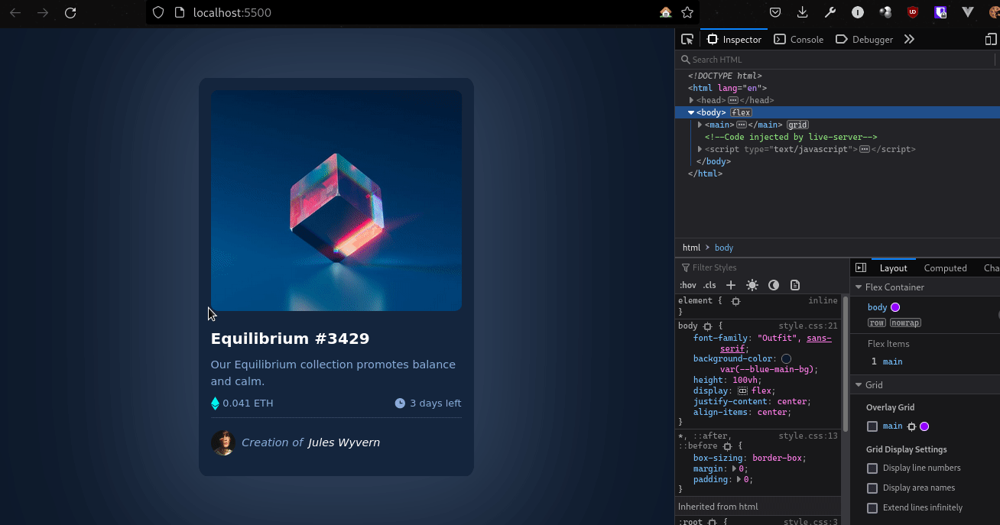

# Frontend Mentor - NFT preview card component solution

This is a solution to the [NFT preview card component challenge on Frontend Mentor](https://www.frontendmentor.io/challenges/nft-preview-card-component-SbdUL_w0U). Frontend Mentor challenges help you improve your coding skills by building realistic projects.

---

Screenshot

## Table of contents

- [Frontend Mentor - NFT preview card component solution](#frontend-mentor---nft-preview-card-component-solution)
  - [Table of contents](#table-of-contents)
  - [Overview](#overview)
    - [The challenge](#the-challenge)
    - [Links](#links)
  - [My process](#my-process)
    - [Built with](#built-with)
    - [Useful resources](#useful-resources)
  - [Author](#author)

## Overview

### The challenge

Users should be able to:

- View the optimal layout depending on their device's screen size
- See hover states for interactive elements

### Links

- Solution URL: [nft-preview-card-component](https://www.frontendmentor.io/solutions/order-summary-card-solution-iQtRLe3h9)
- Live Site URL: [https://nft-preview-card-six.vercel.app/](https://nft-preview-card-six.vercel.app/)

## My process

### Built with

- Semantic HTML5 markup
- CSS custom properties
- Flexbox
- CSS Grid
- Mobile-first workflow

### Useful resources

- [w3schools](https://www.w3schools.com/howto/howto_css_image_overlay.asp) - This helped me to create a fading overlay effect to an image, on hover

## Author

- Website - [imadBG01](https://www.imadbg01.github.io.)
- Frontend Mentor - [@imadbg01](https://www.frontendmentor.io/profile/imadbg01)
- Twitter - [@ImadBg4](https://twitter.com/ImadBg4)
